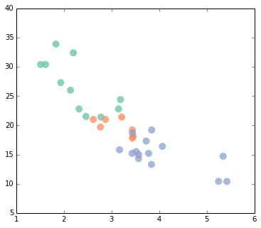

Data Visualization with ``matplotlib``
======================================

Monte Lunacek

Objectives
----------

-  Understand the different between ``pylab`` and ``pyplot``.
-  Understand the basic components of a plot.
-  Understand style
-  Give you enough information to use the
   `gallery <http://matplotlib.org/gallery#>`__.
-  Reference for several standard plots.

   -  histogram, density, boxplot (when appropriate)
   -  scatter, line, hexbin
   -  contour, false-color

References
----------

This tutorial based on some of the following excellent content.

-  `J.R. Johansson's
   tutorial <http://nbviewer.ipython.org/github/jrjohansson/scientific-python-lectures/blob/master/Lecture-4-Matplotlib.ipynb>`__
-  `Matplotlib tutorial by Jake
   Vanderplas <http://jakevdp.github.io/mpl_tutorial/>`__
-  `Nicolas P. Rougier's
   tutorial <http://www.loria.fr/~rougier/teaching/matplotlib/>`__
-  `Painless create beautiful
   matplotlib <http://blog.olgabotvinnik.com/post/58941062205/prettyplotlib-painlessly-create-beautiful-matplotlib>`__
-  `Making matplotlib look like
   ggplot <http://messymind.net/2012/07/making-matplotlib-look-like-ggplot/>`__
-  https://github.com/jakevdp/mpld3
-  `Harvard CS109 Data Science
   Class <http://nbviewer.ipython.org/github/cs109/content/blob/master/lec_03_statistical_graphs.ipynb>`__.

Object and Functional Models
----------------------------

**Functional**

-  Emulate ``Matlab``
-  Convension: *implicit state*

   ::

       from pylab import *

**Object-oriented**

-  Not a flat model.
-  ``Figure``, ``Axes``

   ::

       import matplotlib.pyplot as plt

Caution: redundant interface, namespace issues

Enabling plotting
-----------------

**IPython terminal**

::

    ipython --pylab
    ipython --matplotlib

**IPython notebook**

::

    %pylab inline
    %matplotlib inline

    ipython notebook --pylab=inline
    ipython notebook --matplotlib=inline

The funtional ``pylab`` interface
---------------------------------

-  Loads all of ``numpy`` and ``matplotlib`` into the global namesapce.
-  Great for interactive use.

.. code:: python

    #inline to use with notebook (from pylab import *) 
    %pylab inline 

.. parsed-literal::

    Populating the interactive namespace from numpy and matplotlib

.. code:: python

    # make the plots smaller
    rcParams['figure.figsize'] = 8, 4
.. code:: python

    x = linspace(0, 2*pi, 100)
    y = np.sin(x)
    plot(x, y)
    show()

.. code:: python

    hist(randn(1000), alpha=0.5, histtype='stepfilled')
    hist(0.75*randn(1000)+1, alpha=0.5, histtype='stepfilled') #hist?
    show()

.. code:: python

    #hist?
Quick, easy, simple plots.

Object-oriented ``pyplot`` interface
------------------------------------

-  No global variables
-  Separates style from graph
-  Can easily have multiple subplots

.. code:: python

    #restart notebook
    %matplotlib inline
    import matplotlib.pyplot as plt
    import numpy as np
.. code:: python

    import matplotlib as mpl
    mpl.rcParams['figure.figsize'] = 8, 4
.. code:: python

    plot(range(20))

::

    ---------------------------------------------------------------------------
    NameError                                 Traceback (most recent call last)

    <ipython-input-3-d0d4e9792ae1> in <module>()
    ----> 1 plot(range(20))
    

    NameError: name 'plot' is not defined

Good, that's the error we want to see.

The ``figures`` and ``axes`` objects
~~~~~~~~~~~~~~~~~~~~~~~~~~~~~~~~~~~~

First, we create a blank figure. Then we add a subpot.

.. code:: python

    x = np.linspace(0, 2*np.pi, 100) #same as before
    y = np.sin(x)
    
    fig = plt.figure()
    ax = fig.add_subplot(1,1,1) # 1 row, 1 col, graphic 1
    ax.plot(x, y)
    fig.show()

.. image:: mpl_files/mpl_18_0.png

Multiple subplots
~~~~~~~~~~~~~~~~~

.. code:: python

    fig = plt.figure()
    
    ax1 = fig.add_subplot(1,2,1) # 1 row, 2 cols, graphic 1
    ax2 = fig.add_subplot(1,2,2) # graphic 2
    
    ax1.plot(x, y)
    
    ax2.hist(np.random.randn(1000), alpha=0.5, histtype='stepfilled')
    ax2.hist(0.75*np.random.randn(1000)+1, alpha=0.5, histtype='stepfilled')
    
    fig.show()

The ``plt.subplots()`` command
~~~~~~~~~~~~~~~~~~~~~~~~~~~~~~

.. code:: python

    fig, ax = plt.subplots(2,3)
    
    ax[0,0].plot(x, y)
    ax[0,2].hist(np.random.randn(100), alpha=0.5, color="g")
    ax[1,1].scatter(np.random.randn(10), np.random.randn(10), color="r")
    
    fig.show()

plt.plot?

::

    ==========  ========
    character   color
    ==========  ========
    'b'         blue
    'g'         green
    'r'         red
    'c'         cyan
    'm'         magenta
    'y'         yellow
    'k'         black
    'w'         white
    ==========  ========

The ``subplot2grid`` command
----------------------------

.. code:: python

    fig = plt.figure(figsize=(8,6))
    ax1 = plt.subplot2grid((3,3), (0,0), colspan=3)
    ax2 = plt.subplot2grid((3,3), (1,0), colspan=2)
    ax3 = plt.subplot2grid((3,3), (1,2), rowspan=2)
    ax4 = plt.subplot2grid((3,3), (2,0))
    ax5 = plt.subplot2grid((3,3), (2,1))
    fig.tight_layout()
    fig.show()

.. raw:: html

    
    
    
    

    

Sharing axis values
~~~~~~~~~~~~~~~~~~~

.. code:: python

    fig, axes = plt.subplots( 3, 1, sharex = True)
    for ax in axes:
        ax.set_axis_bgcolor('0.95')
    fig.show()
    print axes.shape

.. parsed-literal::

    (3,)

.. code:: python

    fig, axes = plt.subplots( 2, 2, sharex = True, sharey = True)
    plt.subplots_adjust( wspace = 0.1, hspace = 0.1)
    fig.show()
    print axes.shape

.. parsed-literal::

    (2, 2)

How about a little ``d3.js`` with ``mpld3``?
~~~~~~~~~~~~~~~~~~~~~~~~~~~~~~~~~~~~~~~~~~~~

https://github.com/jakevdp/mpld3

.. code:: python

    from mpld3 import enable_notebook
    enable_notebook()
.. code:: python

    fig, ax = plt.subplots(1,2, sharey=True, sharex=True)
    
    print ax.shape
    
    ax[0].plot(x, y, color='green')
    ax[1].scatter(np.random.randn(10), np.random.randn(10), color='red')
    
    fig.show()

.. parsed-literal::

    (2,)

.. raw:: html

    
    
    
    

    

Matplotlib Style
----------------

Who doesn't like feel and `colors <http://colorbrewer2.org/>`__ of
`ggplot <http://ggplot2.org/>`__?

How do we make matplotlib look like this?

Useful exercise (even if you don't appreciate this). References:

-  `Painless create beautiful
   matplotlib <http://blog.olgabotvinnik.com/post/58941062205/prettyplotlib-painlessly-create-beautiful-matplotlib>`__
-  `Making matplotlib look like
   ggplot <http://messymind.net/2012/07/making-matplotlib-look-like-ggplot/>`__

The ``scatter`` plot
~~~~~~~~~~~~~~~~~~~~

.. code:: python

    %matplotlib inline
    import os
    import pandas as pd
    import numpy as np
    import matplotlib.pyplot as plt
    import matplotlib as mpl
.. code:: python

    cars = pd.read_csv(os.path.join('data','cars.csv'))
    cars.head()

.. raw:: html

    

    <table border="1" class="dataframe">
      <thead>
        <tr style="text-align: right;">
          <th></th>
          <th>type</th>
          <th>mpg</th>
          <th>cyl</th>
          <th>disp</th>
          <th>hp</th>
          <th>drat</th>
          <th>wt</th>
          <th>qsec</th>
          <th>vs</th>
          <th>am</th>
          <th>gear</th>
          <th>carb</th>
        </tr>
      </thead>
      <tbody>
        <tr>
          <th>0</th>
          <td>         MazdaRX4</td>
          <td> 21.0</td>
          <td> 6</td>
          <td> 160</td>
          <td> 110</td>
          <td> 3.90</td>
          <td> 2.620</td>
          <td> 16.46</td>
          <td> 0</td>
          <td> 1</td>
          <td> 4</td>
          <td> 4</td>
        </tr>
        <tr>
          <th>1</th>
          <td>      MazdaRX4Wag</td>
          <td> 21.0</td>
          <td> 6</td>
          <td> 160</td>
          <td> 110</td>
          <td> 3.90</td>
          <td> 2.875</td>
          <td> 17.02</td>
          <td> 0</td>
          <td> 1</td>
          <td> 4</td>
          <td> 4</td>
        </tr>
        <tr>
          <th>2</th>
          <td>        Datsun710</td>
          <td> 22.8</td>
          <td> 4</td>
          <td> 108</td>
          <td>  93</td>
          <td> 3.85</td>
          <td> 2.320</td>
          <td> 18.61</td>
          <td> 1</td>
          <td> 1</td>
          <td> 4</td>
          <td> 1</td>
        </tr>
        <tr>
          <th>3</th>
          <td>     Hornet4Drive</td>
          <td> 21.4</td>
          <td> 6</td>
          <td> 258</td>
          <td> 110</td>
          <td> 3.08</td>
          <td> 3.215</td>
          <td> 19.44</td>
          <td> 1</td>
          <td> 0</td>
          <td> 3</td>
          <td> 1</td>
        </tr>
        <tr>
          <th>4</th>
          <td> HornetSportabout</td>
          <td> 18.7</td>
          <td> 8</td>
          <td> 360</td>
          <td> 175</td>
          <td> 3.15</td>
          <td> 3.440</td>
          <td> 17.02</td>
          <td> 0</td>
          <td> 0</td>
          <td> 3</td>
          <td> 2</td>
        </tr>
      </tbody>
    </table>
    
5 rows × 12 columns

    

.. code:: python

    fig, ax = plt.subplots(figsize=(6,4))
    ax.scatter(cars['wt'], cars['mpg'])
    fig.show()

Changing style
~~~~~~~~~~~~~~

Check out `color brewer <http://colorbrewer2.org/>`__ and `brewer2mpl
wiki <https://github.com/jiffyclub/brewer2mpl/wiki>`__

.. code:: python

    import brewer2mpl
    
    color = brewer2mpl.get_map('Set2', 'qualitative', 3).mpl_colors
.. code:: python

    fig, ax = plt.subplots(figsize=(6,5))
    for i, cyl in enumerate([4,6,8]):
        df = cars[cars['cyl'] == cyl]
        ax = plt.scatter(df['wt'], df['mpg'], s=100, alpha=0.95, edgecolor='none', c=color[i])
    fig.show()

The beauty of ``objects``
~~~~~~~~~~~~~~~~~~~~~~~~~

.. code:: python

    def base_figure():
        fig, ax = plt.subplots(figsize=(6,5))
        for index, cyl in enumerate([4,6,8]):
            df = cars[cars['cyl'] == cyl]
            ax.scatter(df['wt'], df['mpg'], c=color[index], s=100, alpha=0.75, edgecolor='none')
        return fig, ax
.. code:: python

    fig, ax = base_figure()
    
    ax.xaxis.set_ticks_position('none')
    ax.yaxis.set_ticks_position('none')  
    
    fig.show()

.. code:: python

    def remove_ticks(ax):
        ax.xaxis.set_ticks_position('none')
        ax.yaxis.set_ticks_position('none')
        
    def remove_splines(ax, spl):
        for s in spl:
            ax.spines[s].set_visible(False)  
    
    def modify_splines(ax, lwd, col):    
        for s in ['bottom', 'left','top','right']:
            ax.spines[s].set_linewidth(lwd)
            ax.spines[s].set_color(col)    
               
.. code:: python

    fig, ax = base_figure()
    
    remove_ticks(ax)
    modify_splines(ax, lwd=0.75, col='0.8')
    remove_splines(ax, ['top','right'])
    
    ax.patch.set_facecolor('0.93')
    ax.grid(True, 'major', color='0.98', linestyle='-', linewidth=1.0)
    ax.set_axisbelow(True)   
    
    fig.show()

Define custom transformations
~~~~~~~~~~~~~~~~~~~~~~~~~~~~~

.. code:: python

    def ggplot(ax):
        
        remove_ticks(ax)
        modify_splines(ax, lwd=0.75, col='0.8')
        remove_splines(ax, ['top','right'])
        
        ax.patch.set_facecolor('0.93')
        ax.grid(True, 'major', color='0.98', linestyle='-', linewidth=1.0)
        ax.set_axisbelow(True)   
.. code:: python

    fig, ax = base_figure()
    ggplot(ax)
    fig.show()

.. image:: mpl_files/mpl_48_0.png

Legends
~~~~~~~

.. code:: python

    def base_figure():
        
        fig, ax = plt.subplots(figsize=(6,5))
        for index, cyl in enumerate([4,6,8]):
            df = cars[cars['cyl'] == cyl]
            ax.scatter(df['wt'], 
                       df['mpg'], 
                       c=color[index], 
                       s=100, 
                       alpha=0.75, 
                       edgecolor='none',
                       label='{0} cyl'.format(cyl))  # adding a label
        
        return fig, ax
    
    fig, ax = base_figure()
    
    ax.legend(loc='best')
    
    ggplot(ax)
    
    fig.show()

.. code:: python

    def nice_legend(ax):
        if ax.legend_ is not None:
            ax.legend_.get_frame().set_linewidth(0)
            ax.legend_.get_frame().set_alpha(0.5)
.. code:: python

    fig, ax = base_figure()
    
    ax.legend(loc='best', scatterpoints=1) # for a single point
    
    ggplot(ax)
    nice_legend(ax)
    
    fig.show()        

Changing your default style
~~~~~~~~~~~~~~~~~~~~~~~~~~~

You can add *some* custom styles in your ``~/.matplotlib/matplotlibrc``
file.

.. code:: python

    fig, ax = base_figure()
    fig.show()

Setting the ``mpl.rcParams``
~~~~~~~~~~~~~~~~~~~~~~~~~~~~

The default figue size.

.. code:: python

    mpl.rcParams['figure.figsize'] = 8, 4
Change the axes background color, turn on grid lines, change the color.

.. code:: python

    mpl.rcParams['axes.facecolor'] = '0.93'
    mpl.rcParams['axes.grid'] = True
    mpl.rcParams['grid.linestyle'] = '-'
    mpl.rcParams['grid.linewidth'] = 1
    mpl.rcParams['grid.color'] = '1.0' 
    mpl.rcParams['axes.axisbelow'] = True
    mpl.rcParams['axes.linewidth'] = 0.5
    mpl.rcParams['axes.edgecolor'] = '0.7' #can't remove some
    mpl.rcParams['xtick.major.size'] = 0.0
    mpl.rcParams['ytick.major.size'] = 0.0
Modify the legend.

.. code:: python

    mpl.rcParams['legend.fancybox'] = True
    mpl.rcParams['legend.scatterpoints'] = 1
    mpl.rcParams['legend.frameon'] = False
.. code:: python

    fig, ax = base_figure()
    ax.legend(loc='best')
    fig.show()

.. image:: mpl_files/mpl_62_0.png

And many more options....

.. code:: python

    mpl.rcParams.keys()[:10]

.. parsed-literal::

    ['agg.path.chunksize',
     'animation.avconv_args',
     'animation.avconv_path',
     'animation.bitrate',
     'animation.codec',
     'animation.convert_args',
     'animation.convert_path',
     'animation.ffmpeg_args',
     'animation.ffmpeg_path',
     'animation.frame_format']

Let's save that for later...

.. code:: python

    import json
    
    with open('mplrc.json','w') as output:
        output.write(json.dumps(mpl.rcParams))
Tricks with ``itertools`` and ``functools``
~~~~~~~~~~~~~~~~~~~~~~~~~~~~~~~~~~~~~~~~~~~

.. code:: python

    fig, ax = plt.subplots(figsize=(6,5))
    
    for index, cyl in enumerate([4,6,8]):
        df = cars[cars['cyl'] == cyl]
        ax.scatter(df['wt'], 
                   df['mpg'], 
                   c=color[index], 
                   s=100, 
                   alpha=0.75, 
                   edgecolor='none',
                   label='{0} cyl'.format(cyl))  # adding a label
        
    ax.legend(loc='best')
    fig.show()

.. code:: python

    import itertools
    from functools import partial
.. code:: python

    color_iter = itertools.cycle(color)
    partial_scatter = partial(plt.scatter, s=100, alpha=0.75, edgecolor='none')
.. code:: python

    fig, ax = plt.subplots(figsize=(6,5))
    for cyl in [4,6,8]:
        df = cars[cars['cyl'] == cyl]
        
        ax = partial_scatter(df['wt'], df['mpg'], c=next(color_iter), label='{0} cyl'.format(cyl))
    
    fig.show()

How about as a ``d3`` svg?
~~~~~~~~~~~~~~~~~~~~~~~~~~

https://github.com/jakevdp/mpld3

.. code:: python

    from mpld3 import enable_notebook
    enable_notebook()
    
    fig, ax = base_figure()
    #ax.legend(loc='best')  # Note quite yet
    fig.show()

.. raw:: html

    
    
    
    

    

Examples
--------

.. code:: python

    %matplotlib inline
    import numpy as np
    import matplotlib.pyplot as plt
    import matplotlib as mpl
A little style from the previous session.

.. code:: python

    import json
    import brewer2mpl
    
    data = json.loads(open('mplrc.json','r').read())
    for x in data.keys():
        try:
            mpl.rcParams[x] = data[x]
        except ValueError:
            pass
            
    colors = brewer2mpl.get_map('Set1', 'qualitative', 8).mpl_colors
    mpl.rcParams['axes.color_cycle'] = colors
The ``line`` graph
~~~~~~~~~~~~~~~~~~

plt.plot?

.. code:: python

    fig, ax = plt.subplots()
    ax.plot(np.random.randn(200).cumsum())
    fig.show()

.. code:: python

    fig, ax = plt.subplots()
    for i in range(8):
        ax.plot(np.random.randn(200).cumsum())
    fig.show()

.. image:: mpl_files/mpl_80_0.png

Histogram
~~~~~~~~~

?plt.hist

.. code:: python

    mu = 100
    sigma = 15
    x = mu + sigma * np.random.randn(300)
    
    fig, ax = plt.subplots()
    ax.hist(x, alpha=0.5, bins=20)
    fig.show()

.. code:: python

    fig, ax = plt.subplots()
    for i in range(3):
        x = 20.0*np.random.randn() + sigma*np.random.randn(300)
        ax.hist(x, normed=1, alpha=0.5, histtype='stepfilled', bins=20)
    fig.show()

Kernel Density Estimates
~~~~~~~~~~~~~~~~~~~~~~~~

.. code:: python

    from sklearn.neighbors.kde import KernelDensity
.. code:: python

    fig, ax = plt.subplots()
    for i in range(3):
        
        data = 20.0*np.random.randn() + sigma*np.random.randn(100)
        x = np.linspace(data.min(), data.max(), 100)
    
        # For sklearn
        data = data.reshape(-1, 1)
        x = x.reshape(-1, 1)
        
        kde = KernelDensity().fit(data)  # you can adjust the 'bandwidth' parameter
        density = np.exp(kde.score_samples(x))
        ax.plot(x, density)
    
    fig.show()

``Scipy.stats``
~~~~~~~~~~~~~~~

.. code:: python

    from scipy import stats
    
    fig, ax = plt.subplots()
    for i in range(3):
        
        x = 20.0*np.random.randn() + sigma*np.random.randn(300)
        xd = np.linspace(min(x)-10, max(x)+10, 100)
        density = stats.kde.gaussian_kde(x)
        ax.plot(xd, density(xd))
        
    fig.show()

``fill_between``
~~~~~~~~~~~~~~~~

.. code:: python

    import itertools
    colors = itertools.cycle(mpl.rcParams['axes.color_cycle'])
    
    fig, ax = plt.subplots()
    for i in range(4):
        
        x = 20.0*np.random.randn() + sigma*np.random.randn(300)
        xd = np.linspace(min(x)-10, max(x)+10, 100)
        density = stats.kde.gaussian_kde(x)
        
        ax.fill_between(xd, 0, density(xd), alpha=0.25, color=next(colors), linewidth=2)
        
    fig.show()

Combined ``hist`` and ``kde``
~~~~~~~~~~~~~~~~~~~~~~~~~~~~~

.. code:: python

    fig, ax = plt.subplots()
    for i in range(2):
        
        x = 20.0*np.random.randn() + sigma*np.random.randn(300)
        xd = np.linspace(min(x)-10, max(x)+10, 100)
        density = stats.kde.gaussian_kde(x)
        c = next(colors)
        
        ax.hist(x, normed=1, alpha=0.25, color=c, histtype='stepfilled')
        ax.plot(xd, density(xd), alpha=0.75, color=c, linewidth=2)
        
    fig.show()

Bar charts
~~~~~~~~~~

Adapted from `Harvard
CS109 <http://nbviewer.ipython.org/github/cs109/content/blob/master/lec_03_statistical_graphs.ipynb>`__.

.. code:: python

    years = [2004, 2005, 2006, 2007, 2008]
    heights = [501, 607, 709, 650, 532]
    box_colors = mpl.rcParams['axes.color_cycle']  
    
    fig, ax = plt.subplots()
    
    ax.bar(np.array(years)-0.4, heights, color=box_colors, alpha=0.75)
    
    ax.set_xlim(2003.5, 2008.5)
    ax.set_ylim(0,800)
    
    for x, y in zip(years, heights):
        plt.annotate('{0}'.format(y), (x, y + 20), ha='center')
    
    fig.show()

.. image:: mpl_files/mpl_94_0.png

The ``box`` plot
~~~~~~~~~~~~~~~~

.. code:: python

    fig, ax = plt.subplots()
    
    d1 = 20.0*np.random.randn() + sigma*np.random.randn(300)
    d2 = 20.0*np.random.randn() + sigma*np.random.randn(300)
    
    data = [d1, d2]
    bp = ax.boxplot(data, widths=0.65)
    
    fig.show()

Error bars
~~~~~~~~~~

.. code:: python

    x = np.linspace(0, 10, 50)
    xerr = np.random.normal(np.sin(x), 0.4)
    y = np.sin(x)
    
    fig, ax = plt.subplots()
    
    ax.plot(x, y)
    ax.errorbar(x, y, xerr, fmt='.k')
    
    fig.show()

.. code:: python

    fig, ax = plt.subplots()
    
    ax.plot(x, y)
    ad = abs(y-xerr)
    ax.fill_between(x, y - ad, y + ad, color='0.5', alpha=0.2)
    
    fig.show()

.. code:: python

    from sklearn.datasets import make_blobs
    
    X, _ = make_blobs(n_samples=20000, centers=2, random_state=37, cluster_std=4)
    x = X[:,0]
    y = X[:,1]
    
    fig, ax = plt.subplots()
    
    ax.plot(x,y, 'o', alpha=0.02)
    
    fig.show()

.. code:: python

    fig, ax = plt.subplots(figsize=(6,5))
    
    ax.hexbin(x, y, gridsize=20)
    
    fig.show()

.. code:: python

    blues=plt.get_cmap('Blues')
    
    fig, ax = plt.subplots()
    
    tmp = ax.hexbin(x, y, gridsize=40, cmap=blues)
    fig.colorbar(tmp, ax=ax)
    fig.show()

Contour
~~~~~~~

Create a simple surface.

.. code:: python

    x = np.linspace(-1, 1, 50)
    y = np.linspace(-2, 2, 50)
    
    X, Y = np.meshgrid(x, y)
    z = X*X + Y*Y + X*Y
Default countour.

.. code:: python

    fig, ax = plt.subplots()
    
    ax.contour(x, y, z, 20)
    
    fig.show()

.. code:: python

    fig, ax = plt.subplots()
    
    con = ax.contourf(x, y, z, 20)
    
    fig.colorbar(con, ax=ax)
    fig.show()

.. code:: python

    fig, ax = plt.subplots()
    
    tmp = ax.contour(x, y, z, 20, cmap=blues, alpha=0.9)
    con = ax.contourf(x, y, z, 20, cmap=blues, alpha=1.)
    
    fig.colorbar(con, ax=ax)
    fig.show()

False-color
~~~~~~~~~~~

.. code:: python

    fig, ax = plt.subplots()
    
    im = ax.imshow(z, cmap=blues, interpolation='nearest', origin='lower')
    ax.grid(False)
    #tmp = ax.contour(z, 20)
    
    fig.colorbar(im, ax=ax)
    fig.show()

