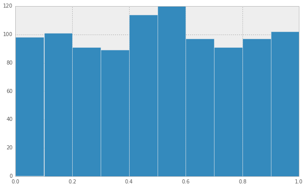
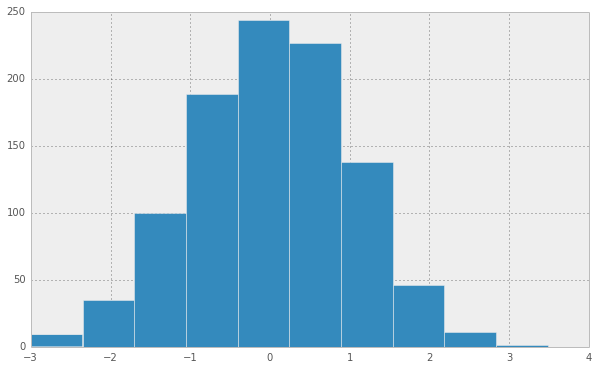
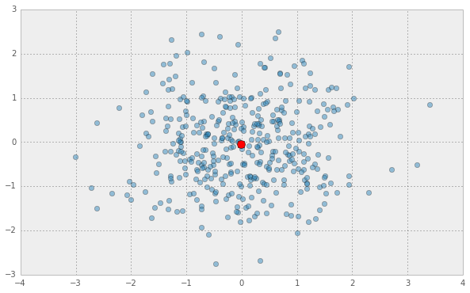
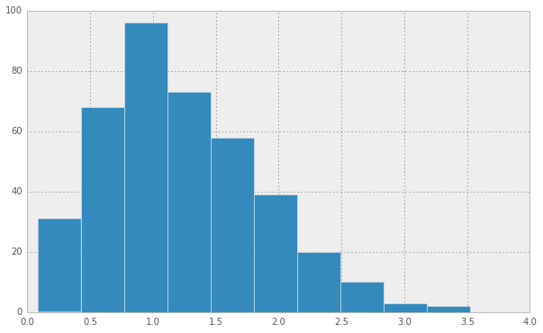

 # Introduction to Numpy

.. raw:: html

   

Monte Lunacek email

.. raw:: html

   

What is ``numpy``?
------------------

Provides ``C``-compiled array-oriented computing in ``Python``.

-  **Efficient**
-  **Foundational**
-  Typed,in-memory
-  Contigous and homeogenous

Usage

-  Scientific data (weather data, satellite data)
-  Image processing
-  Time series
-  Linear algebra

Efficient computing
-------------------

The ``triad`` memory bandwidth `stream
test <http://www.cs.virginia.edu/stream/ref.html>`__.

.. code:: python

    import random
    
    N = 100000
    A = [0 for i in xrange(N)]
    B = [1000.* random.random() for i in xrange(N)]
    C = [1000.* random.random() for i in xrange(N)]
    d = 0.1
.. code:: python

    %%timeit
    for i in xrange(N):
        A[i] = B[i] + d * C[i]

.. parsed-literal::

    10 loops, best of 3: 25.7 ms per loop

The ``numpy`` solution
----------------------

.. code:: python

    import numpy as np
    
    a = np.array(A)
    b = np.array(B)
    c = np.array(C)
Using ``numpy`` matrix syntax.

.. code:: python

    %%timeit
    a = b + d*c

.. parsed-literal::

    1000 loops, best of 3: 302 µs per loop

It's about **100x** times faster (~30 milisecond vs ~ 30 microsecond)

Why is ``numpy`` faster?
------------------------

``numpy``

-  provides a **typed** data structure (``ndarray``)
-  a set of **compiled functions** (``ufuncs``)

``python``

-  Lists: heterogeneous, **dynamically** typed
-  ``for`` loops are **interpreted**

Intel ``MKL`` ``BLAS`` library
------------------------------

Foundational stack
------------------

Outline
-------

Understand the **``ndarray``** data structure

Discuss **ufuncs**

-  Array-oriented computing
-  Avoid for loops
-  Use fast algorithms

Quick note on **slicing** and ``numpy`` views.

**Broadcasting**

The ``ndarray`` object
----------------------

Arrays can be created from

-  lists or tuples
-  using functions
-  reading data from files

.. code:: python

    vector = np.array([1, 2, 3, 4, 5, 6, 7, 8, 9 ])
    print vector
    print type(vector)

.. parsed-literal::

    [1 2 3 4 5 6 7 8 9]
    <type 'numpy.ndarray'>

.. code:: python

    M = np.array([ [1, 2, 3],[4, 5, 6], [7,8,9]], dtype=np.int32)
    print M
    print type(M)

.. parsed-literal::

    [[1 2 3]
     [4 5 6]
     [7 8 9]]
    <type 'numpy.ndarray'>

Properties
~~~~~~~~~~

.. code:: python

    print vector.shape
    print vector.size
    print vector.dtype

.. parsed-literal::

    (9,)
    9
    int64

.. code:: python

    print vector.strides
    print vector.ctypes.data

.. parsed-literal::

    (8,)
    4353561792

Properties
~~~~~~~~~~

.. code:: python

    print M.shape, M.size, M.dtype

.. parsed-literal::

    (4, 4) 16 int64

.. code:: python

    print M.strides, M.ctypes.data

.. parsed-literal::

    (32, 8) 4391835152

Understanding layout and strides
~~~~~~~~~~~~~~~~~~~~~~~~~~~~~~~~

.. code:: python

    A = M.T
    print M.shape, M.size, M.dtype
    print A.shape, A.size, A.dtype

.. parsed-literal::

    (3, 3) 9 int32
    (3, 3) 9 int32

.. code:: python

    print M.strides, M.flags.c_contiguous, M.flags.f_contiguous
    print A.strides, A.flags.c_contiguous, A.flags.f_contiguous

.. parsed-literal::

    (12, 4) True False
    (4, 12) False True

Views
~~~~~

.. code:: python

    print M.ctypes.data, M.flags.owndata
    print A.ctypes.data, A.flags.owndata

.. parsed-literal::

    4302550400 True
    4302550400 False

.. code:: python

    B = A.reshape((A.size,))
    print B.flags.owndata
    print B

.. parsed-literal::

    False
    [1 4 7 2 5 8 3 6 9]

.. code:: python

    print B.shape, B.strides

.. parsed-literal::

    (9,) (4,)

Using array-generating functions
~~~~~~~~~~~~~~~~~~~~~~~~~~~~~~~~

For larger arrays it is inpractical to initialize the data manually

.. code:: python

    print np.arange(1, 6, 0.55)

.. parsed-literal::

    [ 1.    1.55  2.1   2.65  3.2   3.75  4.3   4.85  5.4   5.95]

.. code:: python

    print np.linspace(0, 10, 5)

.. parsed-literal::

    [  0.    2.5   5.    7.5  10. ]

.. code:: python

    print np.zeros(4)
    print np.ones((4,3))

.. parsed-literal::

    [ 0.  0.  0.  0.]
    [[ 1.  1.  1.]
     [ 1.  1.  1.]
     [ 1.  1.  1.]
     [ 1.  1.  1.]]

.. code:: python

    print np.diag([1, 2, 3])

.. parsed-literal::

    [[1 0 0]
     [0 2 0]
     [0 0 3]]

.. code:: python

    %matplotlib inline
    import matplotlib.pyplot as plt
    
    plt.show(plt.hist(np.random.rand(1000)))

.. code:: python

    plt.show(plt.hist(np.random.normal(0,1,1000)))

Using ``ufuncs``
----------------

-  Operate on the elements of one or more ``ndarray``
-  Call optimized c loops based on the ``dtype``

Unary functions
~~~~~~~~~~~~~~~

Several built-in functions that takes one argument:

::

        abs, fabs, sqrt, exp, square, log, ceil, floor

For example

.. code:: python

    x = np.arange(-5.,5.)
    print np.square(x)

.. parsed-literal::

    [ 25.  16.   9.   4.   1.   0.   1.   4.   9.  16.]

.. code:: python

    print np.abs(x)

.. parsed-literal::

    [ 5.  4.  3.  2.  1.  0.  1.  2.  3.  4.]

Binary functions
~~~~~~~~~~~~~~~~

::

        add, subtract, multiply, divide, power, maximum, minimum, greater, less

For example

.. code:: python

    y = np.square(x)
    z = np.add(x,y)
    print z
    print x + y

.. parsed-literal::

    [ 20.  12.   6.   2.   0.   0.   2.   6.  12.  20.]
    [ 20.  12.   6.   2.   0.   0.   2.   6.  12.  20.]

Aggregates
~~~~~~~~~~

::

        sum, mean, std, var, min, max, argmin, argmax, cumsum, cumprod

Examples

.. code:: python

    print z.sum(), np.sum(z)

.. parsed-literal::

    80.0 80.0

.. code:: python

    x = np.random.rand(8).reshape((2,4))
    print x.shape

.. parsed-literal::

    (2, 4)

.. code:: python

    x.sum(axis=0) # sum the columns

.. parsed-literal::

    array([ 1.29243   ,  0.80194978,  0.78560057,  1.7266965 ])

.. code:: python

    x.sum(1) # sum the rows

.. parsed-literal::

    array([ 1.92633601,  2.68034084])

Caution using standard python types
~~~~~~~~~~~~~~~~~~~~~~~~~~~~~~~~~~~

.. code:: python

    x = np.random.random(10000)
    
    %timeit np.sum(x)
    %timeit sum(x)

.. parsed-literal::

    10000 loops, best of 3: 18.6 µs per loop
    100 loops, best of 3: 4.27 ms per loop

Again, about **100x** slower.

The ``accumulate`` methods
~~~~~~~~~~~~~~~~~~~~~~~~~~

.. code:: python

    np.add.accumulate(x)

.. parsed-literal::

    array([  7.24148655e-01,   1.26610691e+00,   1.81818888e+00, ...,
             4.95311123e+03,   4.95406124e+03,   4.95503344e+03])

.. code:: python

    np.cumsum(x)

.. parsed-literal::

    array([  7.24148655e-01,   1.26610691e+00,   1.81818888e+00, ...,
             4.95311123e+03,   4.95406124e+03,   4.95503344e+03])

.. code:: python

    np.*.accumulate?
Linear algebra
~~~~~~~~~~~~~~

::

        dot, inv, diag, trace, eig, det, qr, svd, solve
        

Example matrix multiply

.. code:: python

    x = np.random.rand(8).reshape((2,4))
    b = np.dot(x,x.T)
    print b

.. parsed-literal::

    [[ 1.62791529  1.43280716]
     [ 1.43280716  1.6855133 ]]

Indexing and slicing
--------------------

-  Index slicing is the technical name for the syntax

   ::

       container[lower:upper:step]

   to extract part of an array.

-  We can omit any of the three parameters

   ::

       lower:upper:step

Examples
~~~~~~~~

.. code:: python

    x = np.arange(1, 20, 1)
    print x

.. parsed-literal::

    [ 1  2  3  4  5  6  7  8  9 10 11 12 13 14 15 16 17 18 19]

.. code:: python

    print x[0:10:1]

.. parsed-literal::

    [ 1  2  3  4  5  6  7  8  9 10]

.. code:: python

    print x[:10]

.. parsed-literal::

    [ 1  2  3  4  5  6  7  8  9 10]

.. code:: python

    print x[:10:2]

.. parsed-literal::

    [1 3 5 7 9]

2D slicing
----------

.. code:: python

    M = np.array([ [1, 2, 3],[4, 5, 6], [7,8,9]])

.. code:: python

    print M[0:2]

.. parsed-literal::

    [[1 2 3]
     [4 5 6]]

.. code:: python

    print M[:,0:2]

.. parsed-literal::

    [[1 2]
     [4 5]
     [7 8]]

.. code:: python

    M = np.array(np.arange(1,17)).reshape((4,4))
    print M

.. parsed-literal::

    [[ 1  2  3  4]
     [ 5  6  7  8]
     [ 9 10 11 12]
     [13 14 15 16]]

.. code:: python

    print M[::2, ::2]

.. parsed-literal::

    [[ 1  3]
     [ 9 11]]

Filtering
~~~~~~~~~

.. code:: python

    print x > 10

.. parsed-literal::

    [False False False False False False False False False False  True  True
      True  True  True  True  True  True  True]

.. code:: python

    y = x[x>10]
    print y

.. parsed-literal::

    [11 12 13 14 15 16 17 18 19]

.. code:: python

    mask = (5 < x) * (x < 10)
    print mask

.. parsed-literal::

    [False False False False False  True  True  True  True False False False
     False False False False False False False]

.. code:: python

    print x[mask]

.. parsed-literal::

    [6 7 8 9]

Broadcasting
------------

Arithmetic between ``array``\ s of different, but compatible, shapes.

.. code:: python

    print np.arange(5) + 1

.. parsed-literal::

    [1 2 3 4 5]

.. code:: python

    A = np.arange(8).reshape(4,2)
    B = np.arange(2)
    
    print A.shape, B.shape

.. parsed-literal::

    (4, 2) (2,)

.. code:: python

    A + B

.. parsed-literal::

    array([[0, 2],
           [2, 4],
           [4, 6],
           [6, 8]])

Example
~~~~~~~

Find the distance from the mean of the set to every point?

.. code:: python

    a = np.random.randn(400,2)
    m = a.mean(0)
    plt.plot(a[:,0], a[:,1], 'o', markersize=6, alpha=0.5)
    plt.plot(m[0], m[1], 'ro', markersize=10)
    plt.show()

Euclidean distance

.. math:: d = \sqrt{ \sum (x_i - y_i)^2 }

.. code:: python

    sq = np.square(a - m)
    print sq.shape, a.shape, m.shape

.. parsed-literal::

    (400, 2) (400, 2) (2,)

The mean ``a.mean(0)`` was broadcast to every row in our matrix ``a``.
Now we compute the column sum of ``sq``.

.. code:: python

    ssq = sq.sum(axis=1)
    print ssq.shape

.. parsed-literal::

    (400,)

Now take the ``sqrt``.

.. code:: python

    dist = np.sqrt(ssq)
    print dist.shape

.. parsed-literal::

    (400,)

.. code:: python

    plt.show(plt.hist(dist))

.. code:: python

    print a.mean()

.. parsed-literal::

    -0.0283323177607

.. code:: python

    a.shape

.. parsed-literal::

    (400, 2)

.. code:: python

    a.mean(0).shape

.. parsed-literal::

    (2,)

.. code:: python

    a.mean(1).shape

.. parsed-literal::

    (400,)

.. code:: python

    %%bash
    echo "hello"

.. parsed-literal::

    hello

.. code:: python

    %%writefile test.cpp
    #include <iostream>
    
    int main(){
        std::cout << "hello" << std::endl;
    }

.. parsed-literal::

    Overwriting test.cpp

.. code:: python

    %%bash
    g++ test.cpp
    ./a.out

.. parsed-literal::

    hello

.. code:: python

    %lsmagic

.. parsed-literal::

    Available line magics:
    %alias  %alias_magic  %autocall  %automagic  %autosave  %bookmark  %cd  %clear  %colors  %config  %connect_info  %debug  %dhist  %dirs  %doctest_mode  %ed  %edit  %env  %gui  %hist  %history  %install_default_config  %install_ext  %install_profiles  %killbgscripts  %less  %load  %load_ext  %loadpy  %logoff  %logon  %logstart  %logstate  %logstop  %lsmagic  %macro  %magic  %man  %matplotlib  %more  %notebook  %page  %pastebin  %pdb  %pdef  %pdoc  %pfile  %pinfo  %pinfo2  %popd  %pprint  %precision  %profile  %prun  %psearch  %psource  %pushd  %pwd  %pycat  %pylab  %qtconsole  %quickref  %recall  %rehashx  %reload_ext  %rep  %rerun  %reset  %reset_selective  %run  %save  %sc  %store  %sx  %system  %tb  %time  %timeit  %unalias  %unload_ext  %who  %who_ls  %whos  %xdel  %xmode
    
    Available cell magics:
    %%!  %%HTML  %%SVG  %%bash  %%capture  %%debug  %%file  %%html  %%javascript  %%latex  %%perl  %%prun  %%pypy  %%python  %%python3  %%ruby  %%script  %%sh  %%svg  %%sx  %%system  %%time  %%timeit  %%writefile
    
    Automagic is ON, % prefix IS NOT needed for line magics.

.. code:: python

    %%bash 
    g++ test.cpp
Exercise: Classification
========================

*Supervised learning* algorithms take a set of attributes (or features)
and assigns them a class label based on a set of known instances.
Examples include spam filters for email and fraudulent transactions for
credit cards. The nearest-neighbor classifier is one of the more simple
*supervised learning* algorithms. Given a known set of class instances,
the nearest-neighbor algorithm simply computes the distance from the
unknown candidate to all other instances in the set. The unknown
candidate is assigned the class label of the closest instance.

This example splits the ``iris`` dataset into two sets. We pretend we
don't know the class of the second set and use the nearest-neighbor
classifier to guess the correct class.

This example is taken from Phillipp Janert's book, `Data Analysis with
Open Source Tools <http://shop.oreilly.com/product/9780596802363.do>`__.

Data
----

-  The known set of classes is often called the *training data*.
-  We test the classifiers effectiveness on the *test data*.

.. code:: python

    import os
    import numpy as np
    filename = os.path.join('data','iris_train.csv')
    train = np.loadtxt(filename, delimiter=',', usecols=(0,1,2,3), skiprows=1)
    train_label = np.loadtxt(filename, delimiter=',', usecols=(4,), skiprows=1, dtype=str)
.. code:: python

    print train[1:5,]
    print train.shape
    print train[:5,]

.. parsed-literal::

    [[ 4.9  3.   1.4  0.2]
     [ 4.7  3.2  1.3  0.2]
     [ 4.6  3.1  1.5  0.2]
     [ 5.   3.4  1.5  0.2]]
    (135, 4)
    [[ 5.1  3.5  1.4  0.2]
     [ 4.9  3.   1.4  0.2]
     [ 4.7  3.2  1.3  0.2]
     [ 4.6  3.1  1.5  0.2]
     [ 5.   3.4  1.5  0.2]]

.. code:: python

    print np.unique(train_label)

.. parsed-literal::

    ['Iris-setosa' 'Iris-versicolor' 'Iris-virginica']

.. code:: python

    filename = os.path.join('data','iris_test.csv')
    test = np.loadtxt(filename, delimiter=',', usecols=(0,1,2,3), skiprows=1)
    test_label = np.loadtxt(filename, delimiter=',', usecols=(4,), skiprows=1, dtype=str)
    print test[1:5,]

.. parsed-literal::

    [[ 5.4  3.9  1.3  0.4]
     [ 5.   3.6  1.4  0.2]
     [ 4.6  3.4  1.4  0.3]
     [ 5.   3.4  1.6  0.4]]

Classify
--------

-  For each point in the ``test`` set, find the closest point in the
   ``train`` set.

   -  You will probably use ``broadcasting``
   -  Consider using ``np.argmin``

-  The ``test`` instance gets the label of the closest point.

Accuracy?
---------

-  For each ``test`` instance, check the estimated label against the
   actual label ``test_label``.

