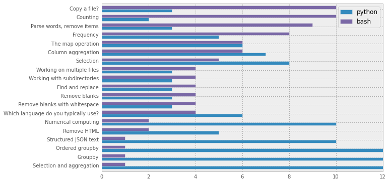

Results
-------

.. code:: python

    import pandas as pd
    import shutil
Clean up the download

.. code:: python

    try:
        filename = '/Users/mlunacek/Downloads/bash_and_python_throw_down.csv'
        shutil.move(filename, 'data/results.csv')
    except IOError:
        print "download file"
    
    data = None
    with open('data/results.csv','r') as infile:
        data = infile.read().decode("utf-16")
    
    with open('data/clean_results.csv','w') as outfile:
        outfile.write(data)

.. parsed-literal::

    download file

.. code:: python

    df = pd.read_csv('data/clean_results.csv', sep='|', skiprows=2)
    df = df.T
.. code:: python

    python = (df == 'python').sum(axis=1)
    bash = (df == 'bash').sum(axis=1)
    tot = pd.concat([python, bash], axis=1)
    tot.columns = ['python','bash']

.. code:: python

    tot.sort('bash').plot(kind='barh')
    show()

