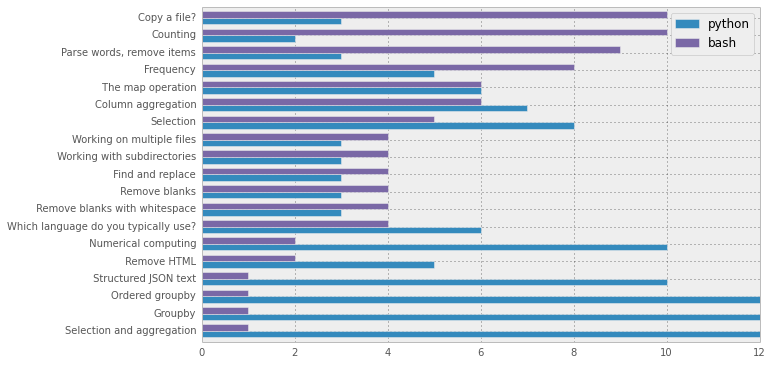

Bash and Python Throw Down
==========================

http://bit.ly/1fWF1ms

Outline
-------

-  Copy
-  Wrangling ``csv`` Files

   -  Column aggregation
   -  Selection
   -  Selection and aggregation
   -  Groupby
   -  Ordered selection

-  Unstructuredd Text Manipulation: Hamlet

   -  Parse words, remove punctuation, remove blank lines.
   -  Counting
   -  Frequency

-  Random

   -  The ``map`` operation
   -  Other Structured Text: e.g. ``json``
   -  Numerical Computing and plotting

-  File maipulation

   -  Find and replace
   -  Remove blank lines
   -  Blank lines with tabs and spaces
   -  Remove HTML tags
   -  Multiple files
   -  Subdirectories

Copy
----

.. code:: python

    import shutil
    
    shutil.copy('back.csv','tmp')
.. code:: python

    !ls tmp

.. parsed-literal::

    tmp

Wrangling ``csv`` Files
-----------------------

.. code:: python

    import pandas as pd
    import numpy as np
Column aggregation
~~~~~~~~~~~~~~~~~~

.. code:: python

    !head data/20140209.csv

.. parsed-literal::

    488112,lucy,UCB00000178,crc-gpu,1,1,14400,12963,547328kb,12987,1391793880,1391905890,1391914447,1391927435,0,singlejob,43.2900
    2490186,wyldstyle,UCB00000191,janus-normal,21,12,86400,21710392,113415320kb,86429,1391841024,1391841024,1391841033,1391927463,-11,default,6050.0300
    2468732,metalbeard,S00000232,janus-small,1,12,43200,159309,298188kb,13393,1391489055,1391914171,1391914191,1391927583,0,default,44.6433
    2468698,metalbeard,S00000232,janus-small,1,12,43200,344489,310540kb,28871,1391488981,1391898836,1391898863,1391927733,0,default,96.2366
    2488073,gandalf,UCB00000178,janus-small,1,12,86400,820612,124072kb,69136,1391791582,1391858648,1391858666,1391927801,0,singlejob,230.4533
    2492322,metalbeard,S00000232,janus-small,1,12,36000,109290,244536kb,9212,1391885555,1391918880,1391919012,1391928224,0,default,30.7066
    2492363,metalbeard,S00000232,janus-small,1,12,36000,108842,248840kb,9174,1391885568,1391919173,1391919205,1391928379,0,default,30.5800
    2492785,badcop,S00000272,janus-short,19,12,7200,2,10692kb,20,1391930340,1391930340,1391930360,1391930381,0,default,1.2666
    2492786,badcop,S00000272,janus-short,19,12,7200,2,10692kb,7,1391930715,1391930715,1391930746,1391930753,0,default,.4433
    2492787,badcop,S00000272,janus-short,19,12,7200,132,233508kb,137,1391930858,1391930858,1391930874,1391931011,0,default,8.6766

.. code:: python

    df = pd.read_csv('data/20140209.csv', header=None)
    df[16].sum()
    #df

.. parsed-literal::

    38062.764099999971

Selection
~~~~~~~~~

All the records for 'gail'

.. code:: python

    df[df[1]=='gail']

.. raw:: html

    

    <table border="1" class="dataframe">
      <thead>
        <tr style="text-align: right;">
          <th></th>
          <th>0</th>
          <th>1</th>
          <th>2</th>
          <th>3</th>
          <th>4</th>
          <th>5</th>
          <th>6</th>
          <th>7</th>
          <th>8</th>
          <th>9</th>
          <th>10</th>
          <th>11</th>
          <th>12</th>
          <th>13</th>
          <th>14</th>
          <th>15</th>
          <th>16</th>
        </tr>
      </thead>
      <tbody>
        <tr>
          <th>418</th>
          <td> 2493201</td>
          <td> gail</td>
          <td> UCB00000256</td>
          <td> janus-small</td>
          <td> 18</td>
          <td> 12</td>
          <td> 28800</td>
          <td>      0</td>
          <td>        0kb</td>
          <td>    0</td>
          <td> 1392007772</td>
          <td> 1392007772</td>
          <td> 1392008303</td>
          <td> 1392008589</td>
          <td> 0</td>
          <td> default</td>
          <td>   0.00</td>
        </tr>
        <tr>
          <th>465</th>
          <td> 2493202</td>
          <td> gail</td>
          <td> UCB00000256</td>
          <td> janus-small</td>
          <td> 18</td>
          <td> 12</td>
          <td> 28800</td>
          <td> 400019</td>
          <td> 86607652kb</td>
          <td> 2660</td>
          <td> 1392007841</td>
          <td> 1392007841</td>
          <td> 1392007886</td>
          <td> 1392010552</td>
          <td> 0</td>
          <td> default</td>
          <td> 159.60</td>
        </tr>
        <tr>
          <th>485</th>
          <td> 2493203</td>
          <td> gail</td>
          <td> UCB00000256</td>
          <td> janus-small</td>
          <td> 18</td>
          <td> 12</td>
          <td> 28800</td>
          <td> 623527</td>
          <td> 83139976kb</td>
          <td> 3618</td>
          <td> 1392007890</td>
          <td> 1392007890</td>
          <td> 1392007918</td>
          <td> 1392011536</td>
          <td> 0</td>
          <td> default</td>
          <td> 217.08</td>
        </tr>
      </tbody>
    </table>
    
3 rows × 17 columns

    

Selection aggregation
~~~~~~~~~~~~~~~~~~~~~

Sum 'gails' column 17.

.. code:: python

    df[df[1]=='gail'][16].sum()

.. parsed-literal::

    376.68000000000001

Groupby operation
~~~~~~~~~~~~~~~~~

Sum column 17 grouped on column 2

.. code:: python

    df.groupby(1)[16].sum()

.. parsed-literal::

    1
    badcop          293.7703
    batman         6135.9999
    benny          6979.0531
    business       1390.0466
    emmet            83.3683
    gail            376.6800
    gandalf        3898.3148
    hansolo          34.8965
    lucy            476.3963
    metalbeard     2188.7720
    shaq            646.0533
    unikitty       1505.7116
    vitruvius       432.3353
    wyldstyle     13621.3661
    Name: 16, dtype: float64

Ordered selection
~~~~~~~~~~~~~~~~~

Show the top 6 users.

.. code:: python

    df.groupby(1)[16].sum().order(ascending=False).head(6)

.. parsed-literal::

    1
    wyldstyle     13621.3661
    benny          6979.0531
    batman         6135.9999
    gandalf        3898.3148
    metalbeard     2188.7720
    unikitty       1505.7116
    Name: 16, dtype: float64

Unstructuredd Text Manipulation: Hamlet
---------------------------------------

Parse words, remove punctuation, remove blank lines.
~~~~~~~~~~~~~~~~~~~~~~~~~~~~~~~~~~~~~~~~~~~~~~~~~~~~

.. code:: python

    !head data/hamlet.txt

.. parsed-literal::

    	HAMLET
    
    
    	DRAMATIS PERSONAE
    
    
    CLAUDIUS	king of Denmark. (KING CLAUDIUS:)
    
    HAMLET	son to the late, and nephew to the present king.
    

.. code:: python

    import re
    import string
    
    data = open('data/hamlet.txt').read()
    data = data.lower() #conver to lower
    data = re.sub('\s*[\n]{2,}', '\n', data) # remove empty lines
    data = re.sub('[%s]' % re.escape(string.punctuation), '', data) 
    words = re.findall(r'\w+', data)
    words[:10]

.. parsed-literal::

    ['hamlet',
     'dramatis',
     'personae',
     'claudius',
     'king',
     'of',
     'denmark',
     'king',
     'claudius',
     'hamlet']

.. code:: python

    print 'total number of lines', len(data.split('\n'))
    print 'total number of words', len(words)
    print 'total number of chars', len(''.join(words))

.. parsed-literal::

    total number of lines 3673
    total number of words 26892
    total number of chars 113918

Counting
~~~~~~~~

How many unique words did Shakespeare use?

.. code:: python

    print len(set(words))

.. parsed-literal::

    4263

What is the average word length?

.. code:: python

    np.mean(map(len, set(words)))

.. parsed-literal::

    6.3893971381656112

Frequency
~~~~~~~~~

What are the 10 most common words?

.. code:: python

    data = {}
    for w in words:
        data[w] = data.get(w,0)+1
        
    for w in sorted(data.items(), key=lambda x: x[1], reverse=True)[:10]:
      print w    
        

.. parsed-literal::

    ('the', 929)
    ('and', 842)
    ('to', 629)
    ('of', 562)
    ('you', 488)
    ('i', 463)
    ('my', 438)
    ('a', 438)
    ('in', 370)
    ('hamlet', 363)

What are the 10 most common words used in Hamlet that are longer than 3?

.. code:: python

    words = sorted(data.items(), key=lambda x: x[1], reverse=True)
    tmp = [ x for x in words if len(x[0]) > 3] 
    for w in tmp[:10]:
        print w

.. parsed-literal::

    ('hamlet', 363)
    ('that', 330)
    ('lord', 277)
    ('this', 237)
    ('with', 231)
    ('your', 211)
    ('what', 174)
    ('king', 167)
    ('have', 147)
    ('will', 134)

The ``map`` operation
---------------------

``qdel`` all queued jobs

.. code:: python

    # option one
    df = pd.read_table('data/joblist.txt', delimiter=r"\s+", header=None, skiprows=5) #<- fixed value
    job_ids = df[0].map(lambda x: re.findall(r'(^[0-9]+)', x)[0]).values
    job_ids

.. parsed-literal::

    array(['2515176', '2447765', '2450992', '2497824', '2498067', '2498068',
           '2498106', '2498107', '2498108', '2512144', '2512145', '2512168',
           '2512169', '2512170', '2512181', '2512182', '2512183', '2512184',
           '2512185', '2512211', '2514880', '2514881', '2514882', '2514883',
           '2514884', '2514886', '2514887', '2514888', '2514889', '2517128',
           '2517139', '2517140', '2517297', '2517298', '2517299', '2517300',
           '2517301', '2517659', '2517673', '2517835', '2517836'], dtype=object)

.. code:: python

    import subprocess
    import functools
    
    def run_command(cmd, x):
        pid = subprocess.Popen([cmd,str(x)], stdout=subprocess.PIPE)
        pid.wait()
        output, _ = pid.communicate()
        return output
        
.. code:: python

    qdel = functools.partial(run_command, 'echo') #could be qdel
    results = map(qdel, job_ids)
.. code:: python

    print results

.. parsed-literal::

    ['2515176\n', '2447765\n', '2450992\n', '2497824\n', '2498067\n', '2498068\n', '2498106\n', '2498107\n', '2498108\n', '2512144\n', '2512145\n', '2512168\n', '2512169\n', '2512170\n', '2512181\n', '2512182\n', '2512183\n', '2512184\n', '2512185\n', '2512211\n', '2514880\n', '2514881\n', '2514882\n', '2514883\n', '2514884\n', '2514886\n', '2514887\n', '2514888\n', '2514889\n', '2517128\n', '2517139\n', '2517140\n', '2517297\n', '2517298\n', '2517299\n', '2517300\n', '2517301\n', '2517659\n', '2517673\n', '2517835\n', '2517836\n']

Other Structured Text: ``json``
-------------------------------

Top rated restaurants in Boulder?

.. code:: python

    import json
    
    data = json.loads(open('data/restaurants.json').read())
    
    names = []
    ratings = []
    counts = []
    
    for r in data['businesses']:
        names.append(r['name'])
        ratings.append(r['rating'])
        counts.append(r['review_count'])

.. code:: python

    df = pd.DataFrame({'name': names, 'ratings': ratings, 'counts': counts})
    df.head()

.. raw:: html

    

    <table border="1" class="dataframe">
      <thead>
        <tr style="text-align: right;">
          <th></th>
          <th>counts</th>
          <th>name</th>
          <th>ratings</th>
        </tr>
      </thead>
      <tbody>
        <tr>
          <th>0</th>
          <td> 229</td>
          <td>       Frasca Food and Wine</td>
          <td> 4.5</td>
        </tr>
        <tr>
          <th>1</th>
          <td> 179</td>
          <td> Leaf Vegetarian Restaurant</td>
          <td> 4.0</td>
        </tr>
        <tr>
          <th>2</th>
          <td> 117</td>
          <td>            Flagstaff House</td>
          <td> 4.5</td>
        </tr>
        <tr>
          <th>3</th>
          <td>  92</td>
          <td>           Black Cat Bistro</td>
          <td> 4.0</td>
        </tr>
        <tr>
          <th>4</th>
          <td> 336</td>
          <td>                The Kitchen</td>
          <td> 4.0</td>
        </tr>
      </tbody>
    </table>
    
5 rows × 3 columns

    

.. code:: python

    df[['name','ratings','counts']].sort('ratings', ascending=False).head(10)

.. raw:: html

    

    <table border="1" class="dataframe">
      <thead>
        <tr style="text-align: right;">
          <th></th>
          <th>name</th>
          <th>ratings</th>
          <th>counts</th>
        </tr>
      </thead>
      <tbody>
        <tr>
          <th>9 </th>
          <td>                Nepal Cuisine</td>
          <td> 4.5</td>
          <td>  77</td>
        </tr>
        <tr>
          <th>10</th>
          <td>                   Il Pastaio</td>
          <td> 4.5</td>
          <td> 144</td>
        </tr>
        <tr>
          <th>2 </th>
          <td>              Flagstaff House</td>
          <td> 4.5</td>
          <td> 117</td>
        </tr>
        <tr>
          <th>0 </th>
          <td>         Frasca Food and Wine</td>
          <td> 4.5</td>
          <td> 229</td>
        </tr>
        <tr>
          <th>15</th>
          <td>     Arugula Bar E Ristorante</td>
          <td> 4.0</td>
          <td>  72</td>
        </tr>
        <tr>
          <th>13</th>
          <td>            Native Foods Cafe</td>
          <td> 4.0</td>
          <td>  77</td>
        </tr>
        <tr>
          <th>12</th>
          <td>                    L'Atelier</td>
          <td> 4.0</td>
          <td>  76</td>
        </tr>
        <tr>
          <th>11</th>
          <td>               Jax Fish House</td>
          <td> 4.0</td>
          <td> 148</td>
        </tr>
        <tr>
          <th>18</th>
          <td>               Tandoori Grill</td>
          <td> 4.0</td>
          <td>  77</td>
        </tr>
        <tr>
          <th>8 </th>
          <td> The Mediterranean Restaurant</td>
          <td> 4.0</td>
          <td> 375</td>
        </tr>
      </tbody>
    </table>
    
10 rows × 3 columns

    

Numerical Computing and plotting
--------------------------------

.. code:: python

    deg = np.arange(0,45,5)
    
    fah = (9*deg/5.)+32
    
    for d, f in zip(deg, fah):
        print d,f

.. parsed-literal::

    0 32.0
    5 41.0
    10 50.0
    15 59.0
    20 68.0
    25 77.0
    30 86.0
    35 95.0
    40 104.0

.. code:: python

    from mpld3 import enable_notebook
    enable_notebook()
    
    rad = np.arange(-100,100)
    plot(sin(rad/10.))
    show()

.. raw:: html

    
    
    
    

    

Text manipulation
-----------------

Edit replace
~~~~~~~~~~~~

.. code:: python

    tmp = 'This is a sample for text manipulation.\nHere is another line'
    print tmp

.. parsed-literal::

    This is a sample for text manipulation.
    Here is another line

.. code:: python

    tmp.replace(' is ', ' was ') #notice non-mutable

.. parsed-literal::

    'This was a sample for text manipulation.\nHere was another line'

Remove blank lines
~~~~~~~~~~~~~~~~~~

.. code:: python

    data = open('data/blank_lines.txt').read()
    print data

.. parsed-literal::

    line 1
    
    line 3
     
    
    line 6
    
    	
    
    line 10
    

.. code:: python

    print data.replace('\n\n','\n')
    data.replace('\n\n','\n')

.. parsed-literal::

    line 1
    line 3
     
    line 6
    	
    line 10
    

.. parsed-literal::

    'line 1\nline 3\n \nline 6\n\t\nline 10\n'

.. code:: python

    print re.sub('\s*[\n]{2,}', '\n', data)

.. parsed-literal::

    line 1
    line 3
    line 6
    line 10
    

I still need to write this to a file.

Remove ``HTML`` tags
~~~~~~~~~~~~~~~~~~~~

.. code:: python

    from IPython.core.display import HTML
    
    data = open('data/sample.html','r').read()
    
    HTML(data)

.. raw:: html

    
    <!DOCTYPE HTML PUBLIC "-//W3C//DTD HTML 3.2 Final//EN">
    <html>
    <head>
    <title>Slideshow</title>
    </head>
    <body>
    
<a href="https://www.rc.colorado.edu/">Research Computing</a>
	 
    
 This is a paragraph

     
    
 There is a line break above me

    
    </body>
    </html>

.. code:: python

    tmp = re.sub(r'<[^<>]+>', ' ', data)
    print re.sub('[\s*\n\s*]{2,}', '\n', tmp)

.. parsed-literal::

    
    Slideshow
    Research Computing
    This is a paragraph
    There is a line break above me
    

Also check out NLTK

What about acting on multiple files at once?
~~~~~~~~~~~~~~~~~~~~~~~~~~~~~~~~~~~~~~~~~~~~

.. code:: python

    import glob
    
    files = glob.glob('data/*.txt')
    for f in files:
        data = open(f,'r').read()
        data = data.replace('original','replacement')
        # Write data back to f
What if the files are in several subdirectories?
~~~~~~~~~~~~~~~~~~~~~~~~~~~~~~~~~~~~~~~~~~~~~~~~

.. code:: python

    import os
    
    for dirpath, dirnames, files in os.walk('data'):
        for f in files:
            if os.path.splitext(f)[1] == '.txt':
                print os.path.join(dirpath, f)
                # do work on file

.. parsed-literal::

    data/blank_lines.txt
    data/hamlet.txt
    data/joblist.txt
    data/sub/joblist.txt

Results
-------

.. code:: python

    import pandas as pd
    import shutil
Clean up the download

.. code:: python

    try:
        filename = '/Users/mlunacek/Downloads/bash_and_python_throw_down.csv'
        shutil.move(filename, 'data/results.csv')
    except IOError:
        print "download file"
    
    data = None
    with open('data/results.csv','r') as infile:
        data = infile.read().decode("utf-16")
    
    with open('data/clean_results.csv','w') as outfile:
        outfile.write(data)

.. parsed-literal::

    download file

.. code:: python

    df = pd.read_csv('data/clean_results.csv', sep='|', skiprows=2)
    df = df.T
.. code:: python

    python = (df == 'python').sum(axis=1)
    bash = (df == 'bash').sum(axis=1)
    tot = pd.concat([python, bash], axis=1)
    tot.columns = ['python','bash']

.. code:: python

    tot.sort('bash').plot(kind='barh')
    show()

